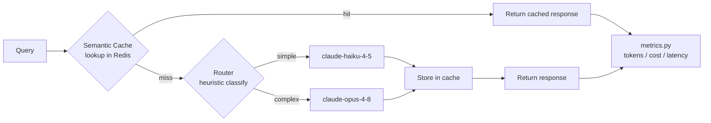

# token-optimizer

Reduces LLM API cost/latency for a fixed set of queries by adding two layers
in front of raw API calls:

1. **Semantic cache** — embeds each query locally and checks Redis for a
   previously-answered query above a similarity threshold, before ever
   calling the model.
2. **Cheap/expensive routing** — on a cache miss, a zero-token heuristic
   classifies the query and sends it to `claude-haiku-4-5` (cheap) or
   `claude-opus-4-8` (expensive) instead of always using one model.

Both layers log through the same `CallRecord` shape (see `src/metrics.py`),
so `results/baseline_results.json` and `results/optimized_results.json` are
directly comparable regardless of which path (cache hit / cheap model /
expensive model) a query took.

## Architecture



## Project structure

```
token-optimizer/
├── README.md
├── requirements.txt
├── .env.example
├── config.py
├── data/
│   └── queries.json              # test queries
├── src/
│   ├── baseline.py               # raw, unoptimized calls
│   ├── cache/
│   │   └── semantic_cache.py     # embedding + Redis lookup
│   ├── routing/
│   │   └── router.py             # cheap vs expensive model logic
│   ├── pipeline.py                # wires cache + router together
│   └── metrics.py                 # token/cost/latency logging
├── results/
│   ├── baseline_results.json      # generated by scripts/run_baseline.py
│   ├── optimized_results.json     # generated by scripts/run_optimized.py
│   └── comparison_table.md
├── scripts/
│   ├── run_baseline.py
│   └── run_optimized.py
└── tests/
    └── test_cache.py
```

## Setup

```bash
pip install -r requirements.txt
cp .env.example .env   # then fill in ANTHROPIC_API_KEY
```

You need a Redis instance reachable at `REDIS_HOST:REDIS_PORT` (defaults to
`localhost:6379`). The quickest way to get one locally:

```bash
docker run -d --name token-optimizer-redis -p 6379:6379 redis:7-alpine
```

## Usage

```bash
python scripts/run_baseline.py     # every query -> claude-opus-4-8, no cache
python scripts/run_optimized.py    # semantic cache + cheap/expensive routing
```

Each script prints a summary (total tokens, cost, avg latency, cache hit
rate) and writes the full per-query log to `results/`. Fill in
`results/comparison_table.md` from those two summaries.

## Tests

```bash
pytest tests/
```

Tests use `fakeredis` and a stub embedder, so they run without a real Redis
instance or network access.

## Tuning

- `SEMANTIC_CACHE_THRESHOLD` (`.env`, default `0.92`) — cosine similarity
  cutoff for a cache hit. Lower it to catch more paraphrases at the risk of
  false-positive hits on genuinely different questions.
- `src/routing/router.py` — the `COMPLEX_KEYWORDS` list and
  `WORD_COUNT_THRESHOLD` control what gets routed to the expensive model.
  Tune these against your own query mix rather than this repo's sample set.
