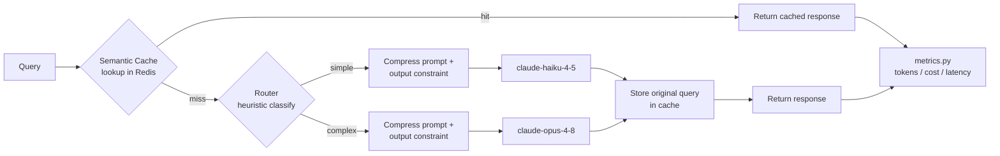

# token-optimizer

Reduces LLM API cost/latency for a fixed set of queries by adding four layers
in front of raw API calls:

1. **Semantic cache** — embeds each query locally and checks Redis for a
   previously-answered query above a similarity threshold, before ever
   calling the model. Doesn't pick a model at all — it avoids calling one.
2. **Cheap/expensive routing** — on a cache miss, a zero-token heuristic
   classifies the query and sends it to `claude-haiku-4-5` (cheap) or
   `claude-opus-4-8` (expensive) instead of always using one model.
3. **Prompt compression** — a rule-based filler-word/phrase stripper
   (`src/compression.py`) shrinks the query actually sent to the model.
   Classification happens on the original query first, so compression can't
   shift routing decisions — each lever's effect stays isolated.
4. **Output constraints** — a system prompt (`src/output_constraints.py`)
   telling the model to answer tersely, cutting output tokens the model
   would otherwise spend on restating the question or hedging.

All four log through the same `CallRecord` shape (see `src/metrics.py`), so
`results/baseline_results.json` and `results/optimized_results.json` are
directly comparable regardless of which path (cache hit / cheap model /
expensive model) a query took, and `compressed` / `output_constrained` /
`chars_saved_by_compression` on each record show which of the extra two
levers applied to that call.

## Results

35-query sample run, `claude-opus-4-8` baseline vs. the full optimized pipeline (cache +
routing + compression + output constraints):

| Metric               | Baseline | Optimized | Change |
|----------------------|---------:|----------:|-------:|
| Total tokens          |   15,357 |    13,109 | **-14.6%** |
| Total cost (USD)      |  $0.3630 |   $0.2605 | **-28.2%** |
| Avg latency (ms)      |    6,188 |     4,937 | **-20.2%** |
| Cache hit rate        |      n/a | 17.1% (6/35) | — |
| Queries routed cheap  |      n/a | 17/35 (Haiku 4.5) | — |

Full breakdown, including an ablation that isolates the compression/output-constraint
levers from cache + routing, is in
[`results/comparison_table.md`](results/comparison_table.md) — worth reading before
citing these numbers, since on this small/terse sample set the output constraint accounts
for nearly all of the win (see the note under Usage below).

## Architecture



## Project structure

```
token-optimizer/
├── README.md
├── requirements.txt
├── .env.example
├── config.py
├── data/
│   └── queries.json              # test queries
├── src/
│   ├── baseline.py               # raw, unoptimized calls
│   ├── cache/
│   │   └── semantic_cache.py     # embedding + Redis lookup
│   ├── routing/
│   │   └── router.py             # cheap vs expensive model logic
│   ├── compression.py             # rule-based filler-word/phrase stripping
│   ├── output_constraints.py      # system prompt that trims output tokens
│   ├── pipeline.py                # wires cache + router + compression + output constraints together
│   └── metrics.py                 # token/cost/latency logging
├── results/
│   ├── baseline_results.json      # generated by scripts/run_baseline.py
│   ├── optimized_results.json     # generated by scripts/run_optimized.py
│   └── comparison_table.md
├── scripts/
│   ├── run_baseline.py
│   └── run_optimized.py
└── tests/
    └── test_cache.py
```

## Setup

```bash
pip install -r requirements.txt
cp .env.example .env   # then fill in ANTHROPIC_API_KEY
```

You need a Redis instance reachable at `REDIS_HOST:REDIS_PORT` (defaults to
`localhost:6379`). The quickest way to get one locally:

```bash
docker run -d --name token-optimizer-redis -p 6379:6379 redis:7-alpine
```

## Usage

```bash
python scripts/run_baseline.py     # every query -> claude-opus-4-8, no cache
python scripts/run_optimized.py    # semantic cache + cheap/expensive routing
```

Each script prints a summary (total tokens, cost, avg latency, cache hit
rate) and writes the full per-query log to `results/`. Fill in
`results/comparison_table.md` from those two summaries.

### A note on compression + output constraints

An ablation compared two configurations of `OptimizedPipeline` (both already include the
semantic cache and routing — this isolates just the compression/output-constraint delta,
not a rerun against the naive baseline): **old** = `compress_prompts=False,
constrain_output=False` (the pipeline's behavior before this session added those two
levers) vs. **new** = `compress_prompts=True, constrain_output=True` (the current
default, all four levers on). See `results/comparison_table.md` for the full table and
`results/ablation_compression_constraint.json` for the per-query data. Net result:
**-16.3% tokens / -22.9% cost** — genuinely optimized.
But on this repo's specific 35-query sample set, almost all of that win comes from the
output constraint, not the compression: `data/queries.json` is made up of short, direct
questions with little verbal padding, so the filler-word/phrase stripper in
`src/compression.py` only trimmed 20 characters total across 30 calls. It's real and
working correctly (see `tests/test_compression.py`), it just doesn't have much to remove in
a dataset this terse and this small — it would show a much larger effect on longer,
more conversationally-phrased queries. Input tokens actually *increased* here too, since the
output-constraint system prompt adds a small fixed cost per call that outweighs a
20-character saving. Don't read this sample's numbers as "compression doesn't help" —
read them as "this dataset is too small and too clean to demonstrate it."

## Tests

```bash
pytest tests/
```

Tests use `fakeredis` and a stub embedder, so they run without a real Redis
instance or network access.

## Tuning

- `SEMANTIC_CACHE_THRESHOLD` (`.env`, default `0.92`) — cosine similarity
  cutoff for a cache hit. Lower it to catch more paraphrases at the risk of
  false-positive hits on genuinely different questions.
- `src/routing/router.py` — the `COMPLEX_KEYWORDS` list and
  `WORD_COUNT_THRESHOLD` control what gets routed to the expensive model.
  Tune these against your own query mix rather than this repo's sample set.
- `src/compression.py` — `FILLER_PHRASES` and `FILLER_WORDS` control what
  gets stripped before a query reaches the model. Pass
  `compress_prompts=False` to `OptimizedPipeline` to disable this lever
  entirely (e.g. for an ablation run).
- `src/output_constraints.py` — `OUTPUT_CONSTRAINT_PROMPT` is the system
  prompt used to cut output tokens. Pass `constrain_output=False` to
  `OptimizedPipeline` to disable it.
